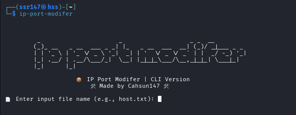

<h1 align="center">IP Port modifer
</h1>

<p align="center">
    A simple CLI and GUI tool to append custom ports to IP addresses from a .txt file.
    
</p>


<p align="center">
    
    
    <br>
    
    
    <br>
    
    
    <br>
</p>

---

## ✨ Features

- Append any custom port to a list of IP addresses from a `.txt` file.
- Output saved in a new file (or overwrites, your choice).
- Available in both:
  - ✅ **CLI (Command Line Interface)**
  - ✅ **GUI (Graphical User Interface)**
- Works with any size file.
- Simple and fast.

---

## 🛠️ Installation

### 1. Clone the repository
```bash
git clone https://github.com/cahsun147/ip-port-modifer.git
cd ip-port-modifer
```

### 2. Install dependencies (required for GUI)

```bash
pip install -r requirements.txt
```

---

## 🚀 Usage

### 🧪 CLI Version

Run the script directly with:

```bash
python3 ip_port_cli.py -i host.txt -o host_with_port.txt -p 8080
```

#### Arguments:

| Argument           | Description                                     |
| ------------------ | ----------------------------------------------- |
| `-i` or `--input`  | Input filename (default: `host.txt`)            |
| `-o` or `--output` | Output filename (default: `host_with_port.txt`) |
| `-p` or `--port`   | Port number to append (required)                |

#### Example:

```bash
ip-port-modifer -i my_ips.txt -o result.txt -p 443
```

> To use this globally, see [🔧 Global CLI Setup](#-global-cli-setup)

---

### 🖼️ GUI Version

Just run the GUI script:

```bash
python3 ip_port_gui.py
```

Steps:

1. Enter a port.
2. Select your `.txt` file with IPs.
3. Choose output location.
4. Done! ✅

---

## 📦 Example

### Input (`host.txt`)

```
8.215.48.196
98.98.117.93
8.215.70.241
```

### Output (with port `8080`)

```
8.215.48.196:8080
98.98.117.93:8080
8.215.70.241:8080
```

---

## 🔧 Global CLI Setup (Optional)

If you want to use `ip-port-modifer` command globally from anywhere:

1. Make a shell script (Linux/macOS):

   ```bash
   echo -e '#!/bin/bash\npython3 /home/ssr147/dev/ip-port-modifer/ip_port_cli.py "$@"' | sudo tee /usr/local/bin/ip-port-modifer > /dev/null 
   chmod +x /usr/local/bin/ip-port-modifer
   ```

2. Now you can run:

   ```bash
   ┌──(ssr147㉿hss)-[~/ip-port-modifer]
   └─$ ip-port-modifer       


         _                      _                   _ _  __         
        (_)_ __   _ __  ___ _ _| |_   _ __  ___  __| (_)/ _|___ _ _ 
        | | '_ \ | '_ \/ _ \ '_|  _| | '  \/ _ \/ _` | |  _/ -_) '_|
        |_| .__/ | .__/\___/_|  \__| |_|_|_\___/\__,_|_|_| \___|_|  
        |_|      |_|                                                

                    📦 IP Port Modifer | CLI Version
                        🛠 Made by Cahsun147 🛠
    
    📄 Enter input file name (e.g., host.txt): /home/ssr147/cve/cv.txt
    🔌 Enter port to append (e.g., 8080): 8080
    💾 Enter output file name (e.g., host_with_port.txt): /home/ssr147/cve/host.txt

    ✅ Successfully saved to: /home/ssr147/cve/host.txt

   ```

> Replace `/full/path/to/` with the actual path to `ip_port_cli.py`.

---

## 📝 License

Copyright © 2021 [Cahsun147](https://github.com/cahsun147). <br />
This project is [MIT](https://github.com/cahsun147/ip-port-modifer?tab=MIT-1-ov-file#) licensed.

---

### 🧠 Made by Cahsun147

Copyright (c) Cahsun147
